# Cashu Pixel

Two Cashu ecash apps for a Raspberry Pi Zero 2 W with a Pimoroni HyperPixel 4.0 Square, a 720×720 touchscreen. Both are written in Rust, with [CDK](https://github.com/cashubtc/cdk) 0.18 for the wallet and [Slint](https://slint.dev) for the UI, drawn by Slint's software renderer.

- **[Cashu NERV](#cashu-nerv)** is a hand-held ecash wallet styled as a NERV terminal. It receives over Lightning, Cashu payment requests or Bluetooth, and sends ecash as a QR code.
- **[Pixel Faucet](#pixel-faucet)** is an always-on faucet. The screen shows one ecash token as a QR code, and when someone claims it, the next one appears.

The apps render the screenshots below themselves, with sample data (see [Screenshots](#screenshots)). The QR codes in them aren't real tokens.

## Cashu NERV

| Home | Receive | Bluetooth receive |
|:-:|:-:|:-:|
| 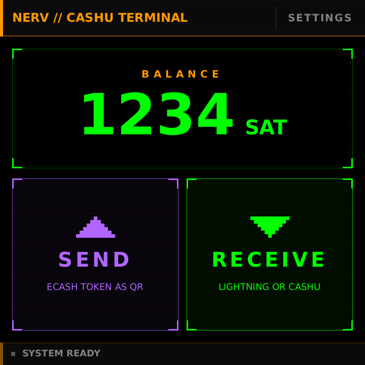 | 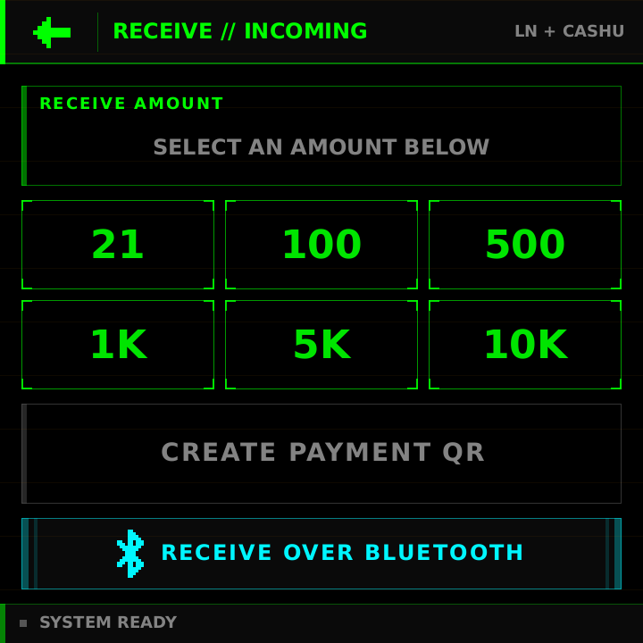 | 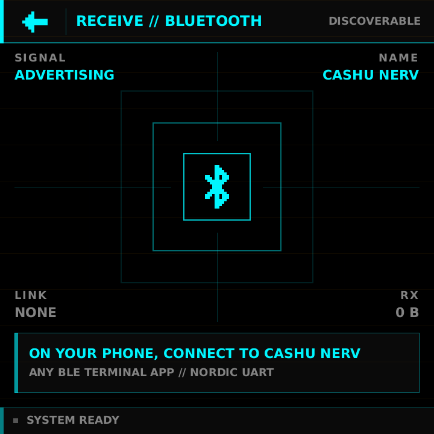 |
| **Token found** | **Redeemed** | **Settings** |
| 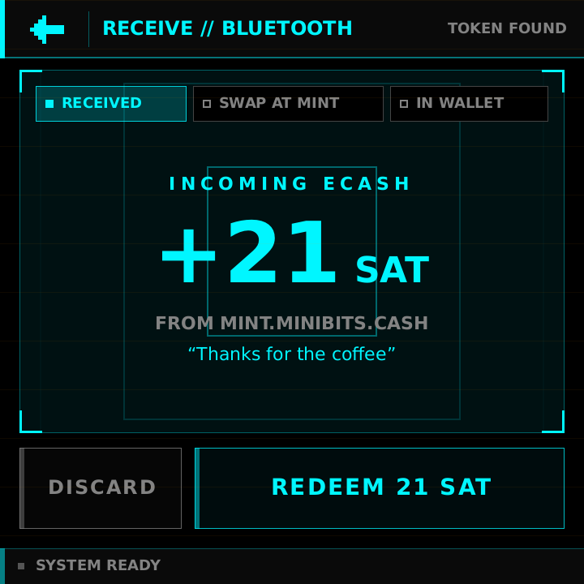 | 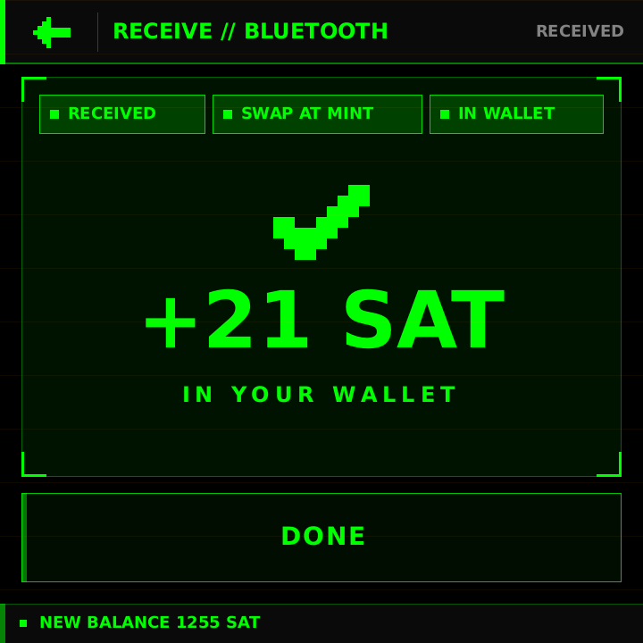 | 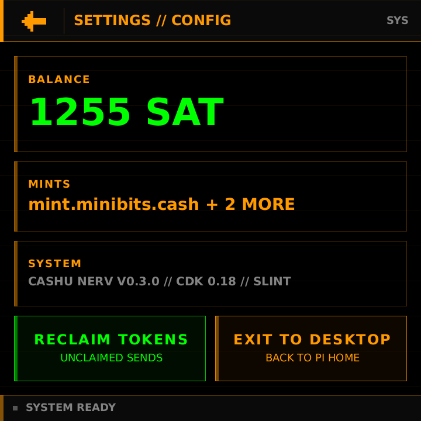 |

- **Receive:** pick an amount. One tap makes both a Lightning invoice and a Cashu payment request (NUT-18) for it, and the screen toggles between the two. Both are watched at once, and the first payment completes the screen. Lightning invoices are checked every 2 seconds and minted automatically. Payment requests ask for Minibits ecash and arrive over Nostr (NIP-17) through relay.damus.io and nos.lol.
- **Bluetooth receive:** the Pi advertises as "Cashu NERV" with the Nordic UART Service. On a phone, connect with any BLE terminal app (Serial Bluetooth Terminal, nRF Toolbox, LightBlue), paste a `cashuA…` or `cashuB…` token and send it. The screen shows the amount, mint and memo, and redeems the token when you tap REDEEM. No pairing is needed.
- **Any mint:** ecash stays at the mint it came from. Minibits is the home mint, where Lightning and payment requests are received. Only sat tokens are accepted.
- **Send:** pick an amount and the screen shows an ecash token as a QR code. The token comes from the home mint when it holds enough, otherwise from the mint holding the most. Tokens over 320 characters are shown as an animated QR code (NUT-16).
- **Settings:** the balance and mints, RECLAIM TOKENS (takes back sent tokens nobody claimed) and EXIT TO DESKTOP.

The seed and `wallet.db` live in `~/.local/share/cashu-pixel`.

## Pixel Faucet

| Claim | Pause | Refill |
|:-:|:-:|:-:|
| 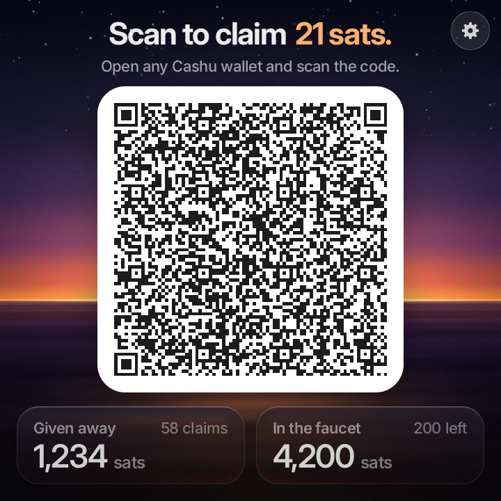 | 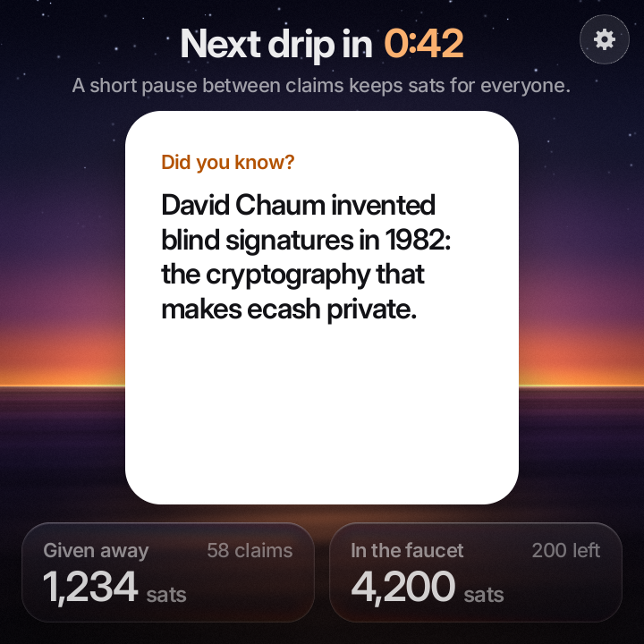 | 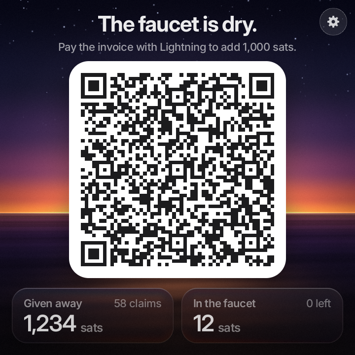 |
| **bitcoin++ theme** | **bitcoin++ pause** | **Settings** |
| 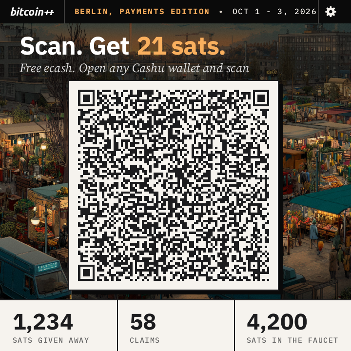 | 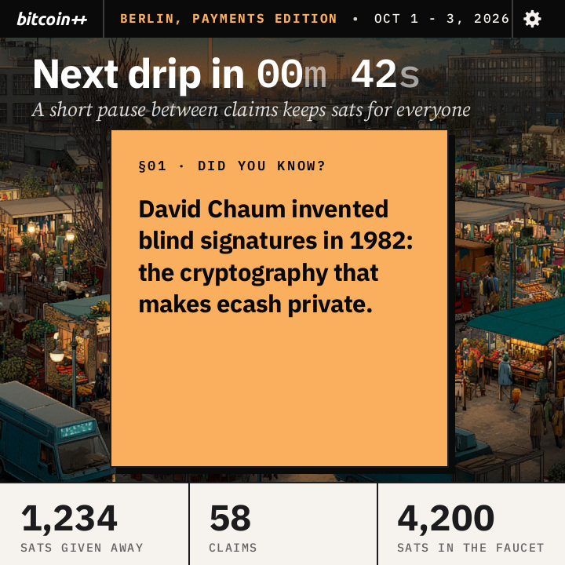 | 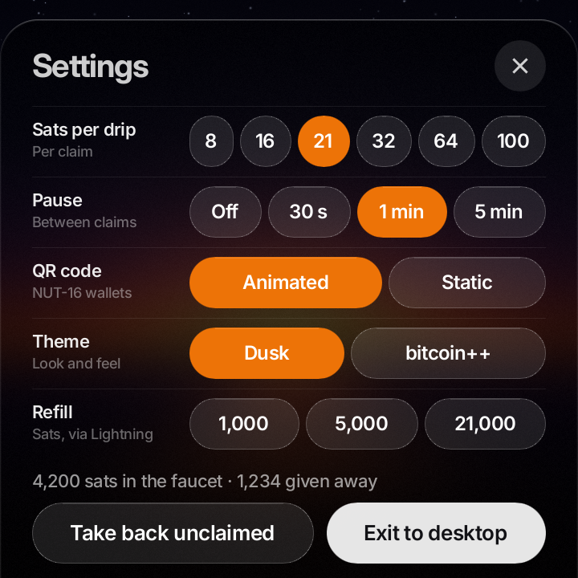 |

The screen always shows one token, 21 sats by default. After someone claims it, the faucet pauses (1 minute by default) so one person can't empty it. The countdown runs in the headline while the card shows Cashu trivia, and then the next token appears. When the faucet runs dry, it shows a Lightning invoice that anyone can pay to refill it.

- **Own wallet:** kept in `~/.local/share/pixel-faucet`, apart from Cashu NERV's. The mint is Minibits.
- **Two themes:** **Dusk**, the faucet's own look inspired by umbrelOS, and **bitcoin++ Berlin**, styled after [btcpp.dev/berlin26](https://btcpp.dev/berlin26). Pick one under Settings.
- **Settings:** the gear at the top right. It sets the sats per drip, the pause, an animated or static QR code, and the theme. It can also refill over Lightning, take back unclaimed tokens, or exit to the desktop.

More detail is in [pixel-faucet/README.md](pixel-faucet/README.md). The bitcoin++ name, wordmark and market artwork belong to bitcoin++.

## Hardware

- Raspberry Pi Zero 2 W
- Pimoroni HyperPixel 4.0 Square (720×720 capacitive touch)
- Raspberry Pi OS (Debian 13 trixie) with the desktop

Both apps install as desktop apps and run fullscreen. With no desktop running, they draw straight to the display (KMS). Bluetooth receive uses the Pi's built-in Bluetooth through BlueZ.

## Build

The apps are compiled for arm64 in Docker. Build the image once:

```sh
docker build --platform linux/arm64 -f Dockerfile.build -t cashu-pixel-build .
```

Then build each app. Build them one at a time, because two release links with LTO can run out of memory in Docker.

```sh
# Cashu NERV
docker run --rm --platform linux/arm64 -v cashu-pixel-target:/app/target -v "$PWD":/app -w /app \
  cashu-pixel-build sh -c 'cargo build --release -p cashu-pixel && cp target/release/cashu-pixel cashu-pixel-arm64'

# Pixel Faucet
docker run --rm --platform linux/arm64 -v cashu-pixel-target:/app/target -v "$PWD":/app -w /app \
  cashu-pixel-build sh -c 'cargo build --release -p pixel-faucet && cp target/release/pixel-faucet pixel-faucet-arm64'
```

## Install on the Pi

Copy the binary and the app's `deploy/` folder to the Pi, then run this there:

```sh
deploy/install.sh ./cashu-pixel-arm64                 # Cashu NERV
pixel-faucet/deploy/install.sh ./pixel-faucet-arm64   # Pixel Faucet
```

Each script adds a menu entry, a desktop icon and a taskbar launcher.

## Screenshots

Both apps take `--snapshot <dir>`. It renders every screen with sample data to PNG files, through the same software renderer as the device, and doesn't touch a wallet or the radio. It runs inside the build container:

```sh
docker run --rm --platform linux/arm64 -v cashu-pixel-target:/app/target -v "$PWD":/app -w /app \
  cashu-pixel-build sh -c './target/release/cashu-pixel --snapshot snapshots/nerv && ./target/release/pixel-faucet --snapshot snapshots/faucet'
```

The images in this README are a selection from those runs, in `docs/screenshots/`.

## Repository layout

| Path | Contents |
|---|---|
| `src/`, `ui/`, `deploy/` | Cashu NERV (the `cashu-pixel` crate) |
| `pixel-faucet/` | Pixel Faucet, its own crate in the Cargo workspace |
| `web/` | an earlier React prototype of the NERV UI, not used on the device |
| `DESIGN.md`, `PRODUCT.md` | Cashu NERV's design system and product notes |
| `docs/screenshots/` | the images in this README |
